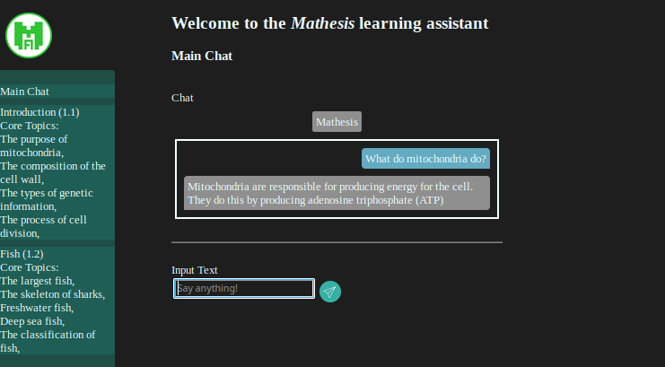

# GPT-Pedagogy
Group 2, 2023

## Our Project

GPT-3 is a Large Language Model which can be used to deprive students out of the 
opportunity to learn through its overuse. Our intended use case of GPT enables the 
transparent use of the technology between instructor and student, and will (hopefully) 
create a more active and participatory learning environment. Our long-term goal for 
higher education is along the lines of the UN SDG 4:

> “Ensure inclusive and equitable quality education and promote lifelong 
> learning opportunities for all”

We view GPT as a way to create an adaptive learning experience which 
promotes the educational endeavor rather than detracts from it.

## Our Goal

Our goal is for our model, *Mathesis*, to maintain its conversational abilities while embedding
additional knowledge about faculty defined key learning objectives. *Mathesis* will
generate a series of topic-relevant questions, evaluate the answers of those questions, and give
useful feedback or counter-examples to the student. The model benefits from human-in-the-loop
reinforcement learning by storing previous chats from students and faculty alike.

We also aim for this model to be generalizable to other classes and disciplines in the future.
The model will work especially well for courses where it is difficult to give personalized
feedback to each learner in each class meeting time. This often happens in classes that have
a high student to faculty ratio. It will also work well for courses with students, interested
in AI, who cannot adequately engage with that interest through the course material.

## Documentation

In addition to this readme, we have also created extensive documentation for our codebase.
This details the usage and qualities of all important functions, classes, and variables within
both the front and back ends of this project.  This documentation is in html format and can be 
found in these locations:

| Docs             | Location                                                                                 |
|------------------|------------------------------------------------------------------------------------------|
| Frontend - JSDoc | [docs/jsdoc/index.html](docs/jsdoc/index.html)                                           |
| Backend - Sphinx | [docs/sphinx/index.html](docs/sphinx/index.html)                                         |
| Project Report   | [docs/finalReport/out/gptPedagogyReport.pdf](docs/finalReport/out/gptPedagogyReport.pdf) |

For the best viewing experience, we recommend cloning the repository and opening up the 
index.html files locally in a web browser.

Additionally, our report for this project can be found [here](docs/finalReport/out/gptPedagogyReport.pdf).

## Quick Start

First, clone this repository and enter its directory.

```bash
git clone https://github.com/ITWSXInformatics/ChatGPT_Pedagogy_Group2_2023 # Clone the repository
cd ChatGPT_Pedagogy_Group2_2023 # Enter its directory
```

> **_NOTE:_** All commands must be run from the root project directory unless otherwise specified.

> **_NOTE:_** If using a python virtual environment, make sure all python commands are run within that environment.
### Prerequisite Software

Before running the program, the following software must be available. Once the main software is
installed, the instructions below will detail how to install the dependencies.

* Python 3.10 or above
  * Dependencies (from [requirements.txt](requirements.txt))
    * pymongo: 4.3.3 
    * openai: 0.27.4 
    * torch: 2.0.0 
    * flask: 2.2.3 
    * pandas: 2.0.0 
    * sphinx: 6.1.3 
    * openpyxl: 3.1.2

First, install the project dependencies using

```bash
pip install -r requirements.txt
```

> **_NOTE:_** Before running the program, ensure that the OpenAI credentials have been provided
> by project developers.

Next, run the backend [app.py](app.py) file.

```bash
python app.py
```

After these have been run, the web interface should be running on [localhost:5000](https://localhost:5000).

## User Interaction

GPT Pedagogy handles all of its end user interaction through the frontend web interface.  This interface
has two separate, but related views:

### The Student View

Here, you will find what the student will be able to see in the deployed version of this project.
It has two main components: the main chat and the lessons.  The main chat does exactly what it says;
it allows students to chat with *Mathesis* and ask course-relevant questions.  Through this interface,
we hope to provide students with a useful learning assistant as they work to complete the second
main component: the lessons.  This section of the project contains a list of lessons that the course
will cover.  Each of these lessons are tied to a series of core concepts that the professor wishes
for the students to learn.  Inside these lessons are a series of quizzes.  Each of the questions
in these quizzes focus on one of the core concepts that the parent lesson covers.  Students will be
able to take these quizzes, submit them, and receive model-generated feedback on their performance.

### The Admin View

This view contains modified versions of the student components.  It also has a main chat and a 
series of lessons.  Similar to the instructor view on LMS, authorized personnel can edit the
content of the quizzes.  They can reject current questions or call upon *Mathesis* to generate
a series of brand-new questions based off of the core concepts in the selected lessons.  Additionally,
users of this view can also request a summary of student performance in CSV format.

> **_NOTE:_** These performance scores are not tied to students' LMS grades in any way.  The project
> is currently designed for these performance scores being only used as a qualitative measure of
> student comprehension, rather than actual gradables.

## Backend Implementation

The core of this project runs on the server, invisible to the clients.  This backend makes heavy
use of OpenAI's Python library and API.  Through this API, we make calls to their *text-davinci-003*
model for the majority of the actions taken by the project.  This model usage is broken into three
main parts.  The chat functionality is governed by [Chat](model/components.py) objects.  These objects
take in user-generated queries and fetch responses from OpenAI.  Question evaluation is governed by
[Evaluate](model/components.py) objects.  These objects take in user responses to quizzes, evaluate
the quality of the answers, and provide feedback on incorrect answers.  This works for both
multiple choice and short answer type questions.  Finally, the [Teacher](model/Teacher.py) object
is the main governor of the models.  It contains both of the previous models and has the added
ability to generate new questions based off of core topics.  By utilizing the conjunction of
these three components, we are able to give *Mathesis* the ability to fulfil all the functional
requirements of this project.

## Diagrams

### The student view

